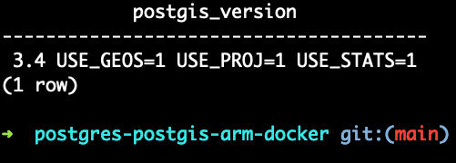

##



### Setup

Let's bring the container up. Image will not exist, so it will build. But we can force a build with --build.
We'll start detached, but we also want to see logs, hence the 2nd instruction.

```
docker compose up -d --build ; docker compose logs -f
```

We didn't create a `.env` file, because we have default values for username and password.
If you want to customize the values, just run:
```
cp .env.example .env
```
And now you customize the values there. They will be used in the `docker-compose` file, instead of the defaults.

Now, let's install Postgis and make sure it's installed:

```
docker compose exec db psql -U myusername -d mydatabase -c 'CREATE EXTENSION postgis'
docker compose exec db psql -U myusername -d mydatabase -c 'SELECT postgis_version()'
```

# If all went well, you should see some output like:

```
## postgis_version

3.4 USE_GEOS=1 USE_PROJ=1 USE_STATS=1
(1 row)
============================================================
```

Happy building!
